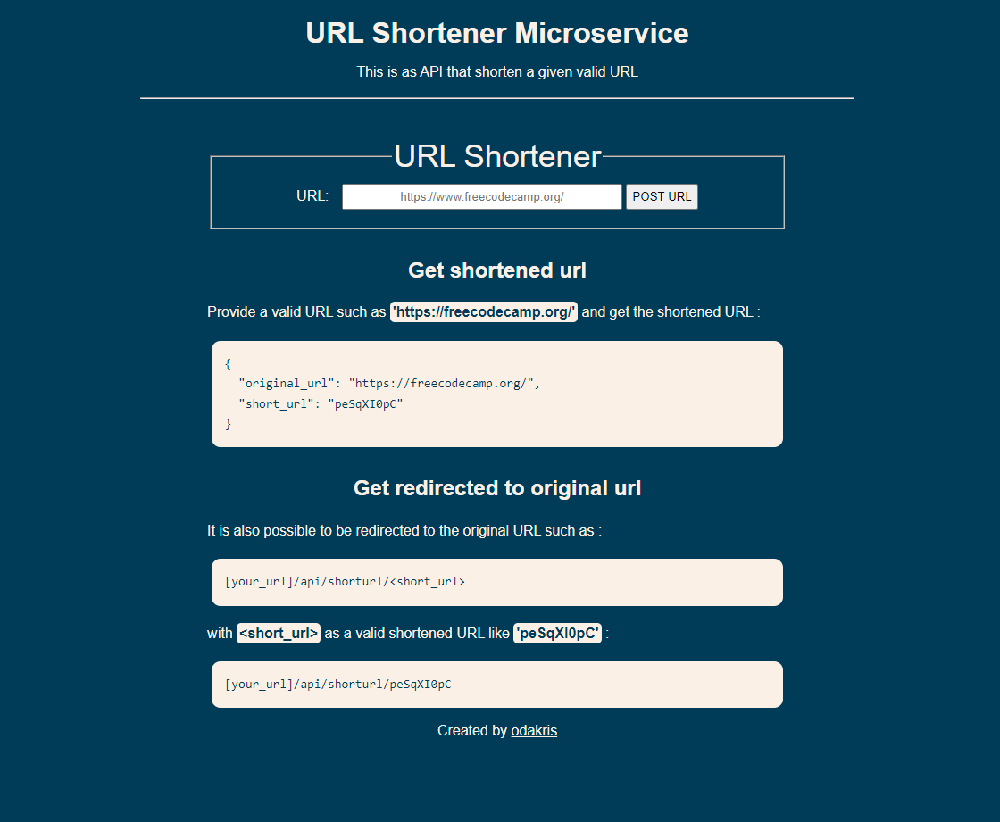

# FCC - URL Shortener Microservice


Live demo of **[URL Shortener Microservice](https://boilerplate-project-urlshortener.odakris.repl.co/)**

## Description

This is the boilerplate code for the URL Shortener Microservice project. Instructions for building your project can be found at https://www.freecodecamp.org/learn/back-end-development-and-apis/back-end-development-and-apis-projects/url-shortener-microservice.

This project is part of the **[freeCodeCamp](https://www.freecodecamp.org/learn/back-end-development-and-apis)** Back End Development and APIs projects certification.

<p align="center">
  
</p>

## Instructions

Clone this repository and install the NPM packages:

```
npm install
```

You will need to sign up to [MongoDB](<[https://account.mongodb.com/account/login?signedOut=true](https://account.mongodb.com/account/login)>). You can use this [tutorial](https://www.freecodecamp.org/news/get-started-with-mongodb-atlas/) to create your own database and then connect to it by pasting your URI into `.env` file. Your `.env` file that contain your URI should look like that:

```
MONGO_URI=`mongodb+srv://<username>:<password>@<cluster-name>.kovsyr7.mongodb.net/<db-name>?retryWrites=true&w=majority`
```

In the project directory, run the following script:

```
npm start
```

Open [http://localhost:3000](http://localhost:3000) to view it in the browser.
